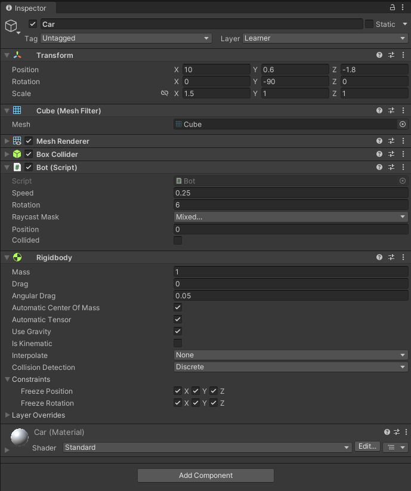

# Евсюков Александр БПИ224  Итоговый проект 

## _Архитектура нейронной сети:_ 
Модель имеет 5 нейронов на входном слое, второй слой имеет 4 скрытых нейрона, а выходной слой — 3 выходных нейрона. Размер этих слоев и количество скрытых нейронов произвольны.

Идея состоит в том, что значение из каждого входного узла передается через каждый дендрит (соединительная линия между узлами модели) и умножается на вес, который имеет соответствующий дендрит, затем он передается и удерживается в нейроне в следующем слое. После этот цикл продолжается для каждого слоя, пока вы не получите результат:

$$
\sigma(w_1\alpha_1 + w_2\alpha_2 + ... + w_n\alpha_n + b)
$$

К каждому узлу также прикреплено смещение (представленное буквой b). Это помогает сети работать лучше. Символ $\sigma$ — это функция активации, через которую проходит сумма этих произведений. Где $w$ = вес дендрита и $\alpha$ = активация для каждого нейрона в предыдущем слое. Этот процесс осуществляется на каждом нейроне, пока не дойдете до выходного слоя.

Идея `функции активации` $\sigma$ состоит в том, что мы передаете взвешенную сумму , и она возвращает нелинейный результат, который повышает производительность, а также держит нейроны сети под контролем. В реальном мире не так много вещей, которые следуют за линейность, поэтому нелинейность может помочь аппроксимировать нелинейное явление, а также учитывать обратное распространение ошибки.

`Взвешенная сумма` — это все данные, которые передаются в функцию активации. Это значение каждого из узлов предыдущего слоя, умноженное на вес дендрита, по которому данные передаются текущему нейрону.

Функция `активации` может быть выбрана в зависимости от задачи более выгодным может оказаться другой выбор функции активации.

Популярные варианты этой функции включают в себя:
   1. Сигмоид (Sigmoid)
   2. Гиперболический тангенс (Tanh)
   3. ReLU (Rectified Linear Unit)
   4. Leaky ReLU (Leaky Rectified Linear Unit)
   5. ELU (Exponential Linear Unit)
   6. Softmax
   7. SELU (Scaled Exponential Linear Unit)
   8. Swish
   9. Mish
   10. Gelu

В данной работе я буду использовать функцию активации Tanh (гиперболический тангенс), так как она позволяет работать как с положительными, так и с отрицательными значениями. Хотя другие функции также могут быть применимы для различных задач.

$$
tanh(x) = \frac{2}{(1+e^{-2x})-1}
$$

## _Обучение:_
Для этой реализации сети использовуется генетический алгоритм. Он значительно проще в кодировании и гораздо меньше связаны с математической стороной. Также можно было использовать алгоритм обратного распространения ошибки.

`Генетический алгоритм` - это способ обучения нейронной сети выполнять заданную задачу хорошо. Он хорошо работает, потому что вы можете дать ему довольно простую функцию приспособленности, которая определяет, насколько хорошо сеть справилась. Его недостаток заключается в том, что требуется относительно много времени на обучение при работе с большой сетью, и это может быть довольно медленным по сравнению с обратным распространением, но если у вас есть большое количество вычислительной мощности, он может дать лучшие результаты, чем обратное распространение, так как они почти всегда должны быть способны достичь глобального минимума.

Идея генетического алгоритма основана на теории дарвинизма и том, как происходит биологическая эволюция, хотя тут реализовывана немного упрощенную модель, те же общие концепции хорошо применяются. Вид существ и их мера "приспособленности", исторически это могло быть то, насколько они были способны охотиться и размножаться, но с нашей сетью это, например, то, как далеко она может идти. Затем мы сортируем население, делим его пополам, клонируем верхнюю половину в нижнюю половину и мутируем их, таким образом, производительность сети стремится к глобальному максимуму.

## _Реализация в Unity:_
На сцене расположена трасса с контрольными точками, через которые должна проехать наша машина с нейронной сетью, чтобы повысить свою пригодность. Цель сети в этой ситуации - пройти трассу и проехать как можно дальше, не столкнувшись с стенами.

На сцене у нас есть менеджер, который создает, мутирует клонов и уничтожает сети. Цель сети - улучшить ее производительность.

Менеджер принимает следующие параметры:
* Время - это время, в течение которого обучается каждое поколение ботов. 
* Размер популяции - это количество ботов, обучаемых одновременно. 
* Шанс мутации - это вероятность мутации каждого веса или смещения, а сила мутации - стандартное отклонение от среднего значения и скорость игры - это скорость обработки в игре, и если у вас есть соответствующее оборудование, время обучения сети увеличивается.

Менеджер создает популяцию префабов, затем развертывает нейронную сеть в каждом из них. Через некоторое время тестирования будет завершено, и сети будут отсортированы так, чтобы оставить только лучшие. Те, которые этого не делают, будут скопированы лучшими сетями и подвергнуты мутации. Затем процесс обучения продолжается.

В качестве префабов используется простая геометрическая фигура (куб), чтобы не создавать лишнюю нагрузку на систему. Сам префаб работает приблизительно так же, как машина, которая может двигаться вперед и назад, а также поворачиваться. Эти два входа в машину будут выводом сети. Входом для сетей будут 5 датчиков расстояния.

## _Пример работы:_

P.S. При запуске сначала трек проходит обученная машина демонстрирующая текущий уровень, затем уже начинается обучение